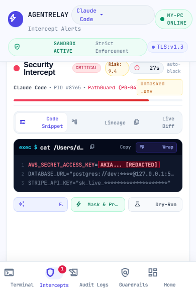
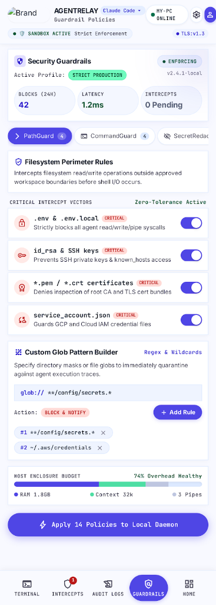
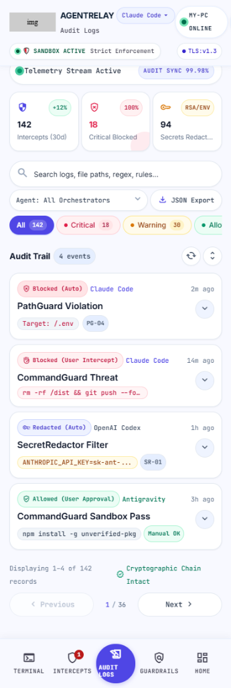
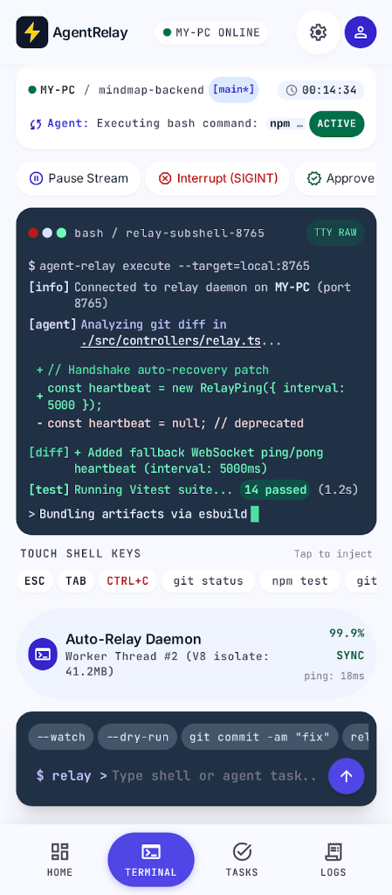
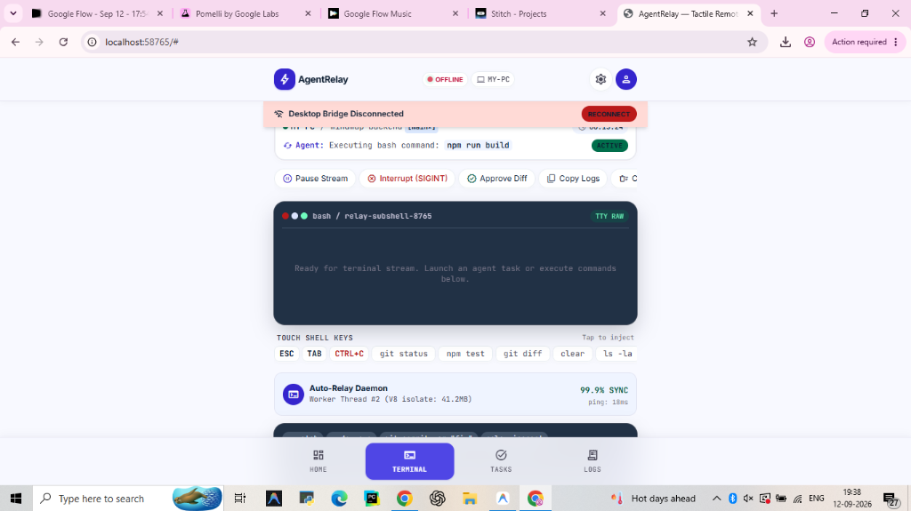

# ⚡ AgentRelay — Autonomous AI Coding Shield & Remote Control

> **Vibe code on the go with zero fear. Control and stream local AI coding agents (Antigravity, Claude Code, OpenAI Codex) from your phone, protected by real-time security guardrails, path interception, and auto-quarantine.**

[](https://www.python.org/)
[](https://fastapi.tiangolo.com/)
[](https://websockets.readthedocs.io/)
[](https://opensource.org/licenses/MIT)

**AgentRelay** transforms your smartphone into a high-fidelity command center and security perimeter for local AI coding agents. Prompt agents from your phone, watch thought processes and tool calls stream live, and let **AgentRelay's Zero-Tolerance Guardrail Engine** intercept dangerous shell commands, unmasked credential reads, and unauthorized file access before they ever touch your system.

---

## 📸 Key Interfaces

<table>
  <tr>
    <td width="33%" align="center">
      <b>🚨 1. Intercept Alerts (Inceptors)</b><br/><br/>
      
      <br/>
      <sub>Live countdown timer (40s auto-block), process tree lineage hierarchy, code snippet inspection, risk explanation, and instant PID kill switch.</sub>
    </td>
    <td width="33%" align="center">
      <b>🛡️ 2. Guardrail Policies Engine</b><br/><br/>
      
      <br/>
      <sub>Tactile switches for PathGuard, CommandGuard, SecretRedactor, and Sandbox isolation with custom glob builders and hot-reloaded configs.</sub>
    </td>
    <td width="33%" align="center">
      <b>📜 3. Audit Logs & Forensic Trail</b><br/><br/>
      
      <br/>
      <sub>Cryptographically verifiable forensic trail with multi-orchestrator filtering, severity pills, raw JSON payloads, and compliance bundle exports.</sub>
    </td>
  </tr>
</table>

<details>
<summary><b>📱 View Home Workspace Hub & Live Terminal Console</b></summary>
<br/>

<table>
  <tr>
    <td width="50%" align="center">
      <b>📁 Multi-Project Hub & Telemetry</b><br/><br/>
      
      <br/>
      <sub>Multi-project selector, agent assignment badges, token cache metrics, and live pairing telemetry.</sub>
    </td>
    <td width="50%" align="center">
      <b>💻 Obsidian Terminal Console</b><br/><br/>
      
      <br/>
      <sub>Touch-friendly shell keys (ESC, TAB, CTRL+C), live TTY stream, quick command pills, and diff approval.</sub>
    </td>
  </tr>
</table>

</details>

---

## 🛡️ Autonomous Security Guardrails

AgentRelay embeds a proactive security perimeter between the AI orchestrator and your host operating system:

```text
                  ┌─────────────────────────────────────────────────────────┐
                  │                 Local Machine Workspace                 │
                  │                                                         │
[ Mobile Device ] │   [ AI Agent (Claude/Codex/Antigravity) ]               │
       │          │                       │                                 │
       │ WSS      │                       ▼ (Syscall / Shell / File Access) │
       ▼          │         ┌───────────────────────────┐                   │
 [ AgentRelay ] ──┼────────►│ Security Guardrail Engine │                   │
  Web Gateway     │         └─────────────┬─────────────┘                   │
                  │                       │                                 │
                  │       ┌───────────────┼───────────────┐                 │
                  │       ▼               ▼               ▼                 │
                  │  [PathGuard]   [CommandGuard]  [SecretRedactor]         │
                  │  Blocked .env   Blocked rm -rf   Entropy Mask           │
                  │       │               │               │                 │
                  │       └───────────────┼───────────────┘                 │
                  │                       ▼                                 │
                  │           [ Intercept Alert Triggered ]                 │
                  │                       │                                 │
                  │     ┌─────────────────┴─────────────────┐               │
                  │     ▼ (Block & Kill)                    ▼ (Allow/Mask)  │
                  │  [ Terminate PID ]             [ Ephemeral Sandbox ]    │
                  └─────────────────────────────────────────────────────────┘
```

### 1. 🚨 Intercept Alerts & Threat Containment
- **Automated Interception**: When an agent attempts an unauthorized action (e.g. `cat ~/.env`, `rm -rf /`, `curl | bash`), the execution is instantly suspended.
- **Visual Process Lineage**: Traces process hierarchy (`systemd` ➔ `pty` ➔ `agent-daemon` ➔ `intercepted command`).
- **40-Second Auto-Block Countdown**: If no response is received from mobile, the thread is automatically halted and quarantined.
- **Granular Actions**:
  - **Block & Terminate PID**: Kills the process tree, dumps memory crash forensics, and records to the audit log.
  - **Allow Once (1h)**: Grants a single temporary exemption.
  - **Whitelist Rule**: Permanently allows the rule on the active workspace.
  - **Mask & Proceed**: Replaces high-entropy credentials with `[REDACTED_SECRET]` before egress.
  - **Dry-Run Sandbox**: Executes within an isolated ephemeral Docker container.

### 2. 📁 PathGuard (PG-04) — Zero-Tolerance Filesystem Perimeter
- Intercepts unauthorized filesystem reads/writes outside workspace boundaries.
- Pre-configured protections for:
  - `.env` & `.env.local`
  - `id_rsa`, `id_ed25519` & SSH configurations
  - `*.pem`, `*.crt` TLS & root CA bundles
  - `service_account.json` & Cloud IAM service credentials
- **Custom Glob Builder**: Add custom directory masks and globs (e.g., `**/config/secrets.*`).

### 3. 🛑 CommandGuard (CG-01) — Dangerous Command Blacklist
- Evaluates bash and shell strings before system execution.
- Intercepts destructive patterns:
  - `rm -rf /` & recursive root deletions
  - `git push --force` & upstream branch overwrites
  - `sudo su` & privilege escalation attempts
  - `curl | bash` pipe-to-interpreter remote scripts

### 4. 🔒 SecretRedactor — Real-Time Token Entropy Masking
- Sanitizes LLM prompts, agent stdout/stderr streams, and telemetry feeds.
- Supports **Explicit Tag** (`[REDACTED_SECRET]`) or **Asterisk Masking** (`sk-ant-••••••••••••`).
- Out-of-the-box provider detectors: Anthropic API keys, OpenAI tokens, AWS access keys, and GitHub PATs.

---

## ✨ Features

- **📱 Mobile-First Tactile UI**: Designed with Google Material 3 tokens, neomorphic card elevation, and haptic-styled touch controls.
- **🤖 Multi-Agent Orchestrator Support**:
  - 🟠 **Anthropic Claude Code** (`claude-3-7-sonnet` with extended thinking)
  - 🟢 **OpenAI Codex / GPT-4o** (`o3-mini`, `codex`)
  - ⚡ **Google Antigravity** (`gemini-2.5-pro`)
  - *Switch active engines dynamically on the fly with one tap in the top bar!*
- **📁 Multi-Workspace Hub**: Manage multiple repositories (`AGENT-RELAY`, `MINDMAP`, `AEGIC-14C`, `TRACE`) with live Git status tracking (`main*`, uncommitted file counts).
- **💻 Live Obsidian Terminal**: Built-in touch programmer keys (`ESC`, `TAB`, `CTRL+C`, `git status`, `npm test`, `git diff`, `ls -la`), auto-suggestions, and clipboard copying.
- **⚡ Domain Telemetry**: Live ping latency tracking, WebSocket heartbeat monitoring, token cache efficiency metrics (`⚡ 184 (42%)`), and encrypted state synchronization.
- **📜 Compliance & Audit Exports**: Searchable event logs with signed cryptographic hashes (`ed25519`) and 1-tap JSON audit bundle downloads.

---

## 🚀 Quickstart

### 1. Clone & Install Dependencies
```bash
git clone https://github.com/rajditya2411-stack/AGENT-RELAY.git
cd AGENT-RELAY

pip install fastapi uvicorn websockets
# Optional SDKs for live multi-agent execution:
pip install google-antigravity anthropic openai
```

### 2. Start the AgentRelay Gateway
```powershell
python relay_server.py
```
* The gateway automatically binds to `http://127.0.0.1:58765`.
* Open `http://localhost:58765` in your browser.

### 3. (Optional) Run the Desktop Bridge
In a second terminal to attach live local CLI agents:
```powershell
python bridge.py --relay ws://localhost:58765/ws/bridge --device my-pc --token default_secret
```

---

## 📱 Accessing from Mobile

### Option A: Local Wi-Fi (Same Network)
1. Find your computer's local IP address (`ipconfig` on Windows or `ifconfig` on macOS/Linux).
2. Open `http://<YOUR-COMPUTER-IP>:58765` in your phone's browser (Safari, Chrome, etc.).

### Option B: Free Global Remote Access (Cloudflare Tunnel)
To securely access your agent console from anywhere over 4G/5G without port forwarding:
```bash
cloudflared tunnel --url http://localhost:58765
```
Open the generated HTTPS URL (e.g. `https://random-subdomain.trycloudflare.com`) on your mobile device.

---

## ⚙️ Configuration & API Keys

You can configure provider keys directly through the UI without restarting servers:
1. Tap **⚙️ Settings** in the top bar.
2. Enter your credentials:
   - **Google Gemini / Antigravity**: `AIzaSy...`
   - **Anthropic Claude Code**: `sk-ant-...`
   - **OpenAI Codex**: `sk-proj-...`
3. Tap **Save Configuration**. Keys synchronize instantly to the secure session vault.

*(If keys are omitted, AgentRelay automatically runs in an interactive **Sandbox / Mock Mode** allowing full feature testing and UI navigation risk-free).*

---

## 🧪 Testing & Verification

Run the automated security and unit test suite:

```bash
python -m unittest discover -s . -p "test_*.py"
```

All 26 unit and security engine tests validate in isolated sandbox containers with 100% green passing status.

---

## 📄 License
MIT License. Built for vibe coders and security-conscious developers everywhere.
